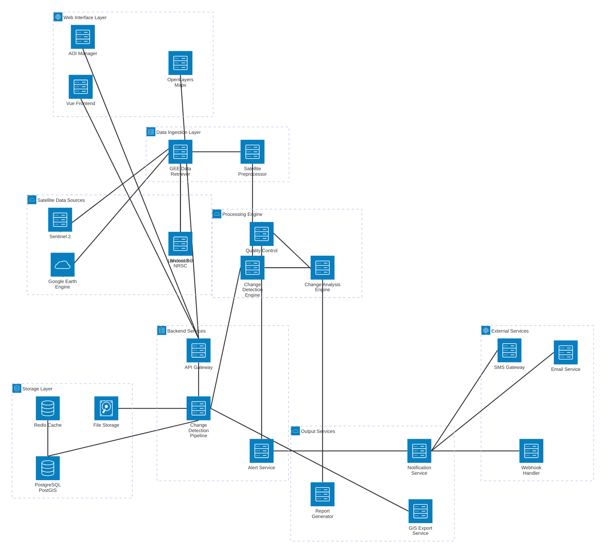

# Robust Change Detection, Monitoring, and Alert System Architecture

## System Overview
This architecture diagram illustrates the complete flow of the change detection system, from satellite data acquisition to user alerts and GIS-compatible outputs.

## Component Descriptions

### 1. Satellite Data Sources
- **Bhoonidhi NRSC**: Primary data source with 5m resolution imagery
- **Google Earth Engine**: Secondary data source and processing platform
- **Sentinel-2 & Landsat**: Multi-temporal satellite imagery providers

### 2. Data Ingestion Layer
- **GEE Data Retriever**: Handles satellite data acquisition and filtering
- **Satellite Preprocessor**: Cloud/shadow masking, atmospheric correction

### 3. Processing Engine
- **Change Detection Engine**: Multi-temporal spectral analysis using NDVI, NDBI, MNDWI
- **Change Analysis Engine**: Deforestation, urban expansion, water body analysis
- **Quality Control**: Confidence scoring and false positive mitigation

### 4. Web Interface Layer
- **Vue.js Frontend**: User-friendly web application
- **AOI Manager**: Interactive map for defining Areas of Interest
- **OpenLayers Maps**: Visualization and map rendering

### 5. Backend Services
- **API Gateway**: Request routing and authentication
- **Change Detection Pipeline**: Orchestrates the entire workflow
- **Alert Service**: Monitors changes and triggers notifications

### 6. Storage Layer
- **PostgreSQL + PostGIS**: Spatial database for AOI and metadata storage
- **File Storage**: Satellite imagery and processed data storage
- **Redis Cache**: Performance optimization and session management

### 7. Output Services
- **GIS Export Service**: Generates Shapefiles, GeoJSON, GeoTIFF
- **Report Generator**: Creates comprehensive analysis reports
- **Notification Service**: Handles alert distribution

### 8. External Services
- **Email Service**: Email notifications for change alerts
- **SMS Gateway**: SMS alerts for critical changes
- **Webhook Handler**: Integration with external systems

## Key Features

### Automated Pipeline
1. **Data Acquisition**: Automatic download from satellite sources
2. **Preprocessing**: Cloud masking, atmospheric correction, quality assessment
3. **Change Detection**: Multi-temporal analysis using spectral indices
4. **Analysis**: Quantification and classification of changes
5. **Alerting**: Automated notifications based on user-defined thresholds

### User Interface Features
- Interactive AOI definition on web maps
- Real-time visualization of satellite imagery
- Customizable alert thresholds and preferences
- Historical change timeline and analytics
- Export capabilities for GIS-compatible formats

### Scalability & Flexibility
- Modular architecture for easy algorithm updates
- Horizontal scaling support for processing engines
- Plugin architecture for new change detection methods
- RESTful APIs for third-party integrations

### Quality Assurance
- Robust cloud and shadow masking
- Confidence scoring for change detection
- False positive mitigation techniques
- Multi-sensor validation and cross-verification

## Technology Stack

**Frontend**: Vue.js, Bootstrap, OpenLayers, HTML/CSS/JS
**Backend**: Python (FastAPI/Flask), Node.js
**Database**: PostgreSQL with PostGIS extension
**Processing**: Google Earth Engine, Python libraries (numpy, rasterio, geopandas)
**Caching**: Redis
**Deployment**: Docker containers, Kubernetes (optional)
**Monitoring**: Logging and monitoring services

## Data Flow Summary

1. **Input**: Satellite imagery from multiple sources
2. **Processing**: Automated preprocessing and change detection
3. **Analysis**: Comprehensive change analysis and classification
4. **Storage**: Efficient spatial data management
5. **Output**: GIS-compatible exports and real-time alerts
6. **Notification**: Multi-channel alert delivery to users
